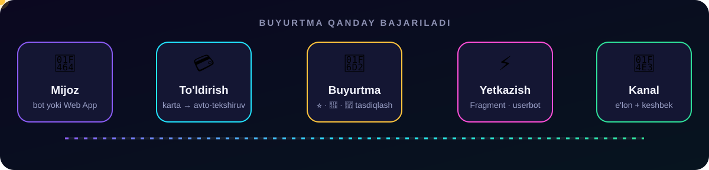
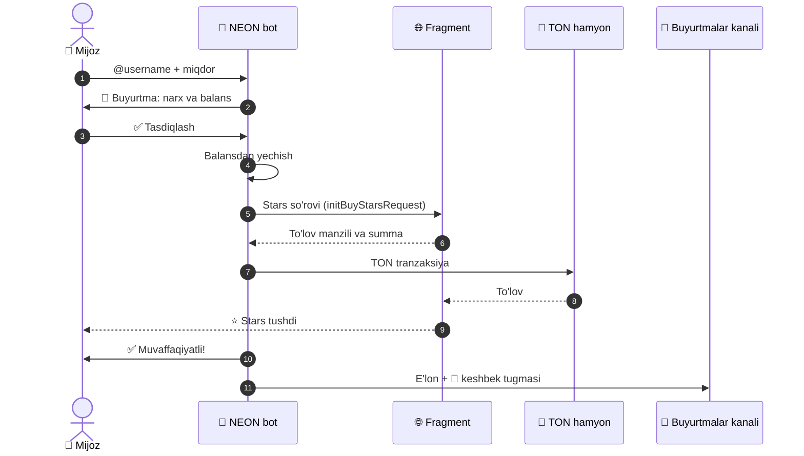
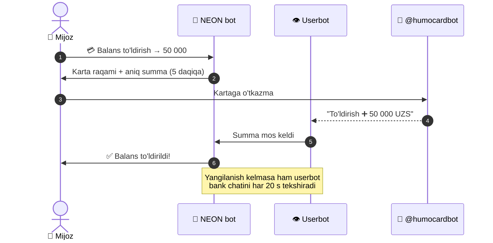
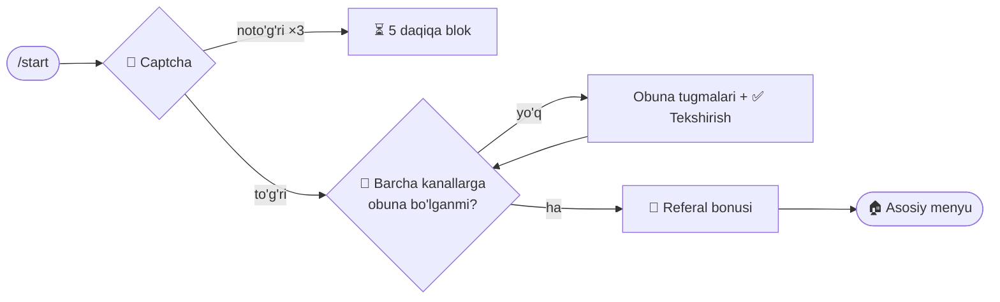

<div align="center">



<br/>

<a href="https://t.me/shop_neonbot"></a>
<a href="https://t.me/Shop_NeonChannel"></a>
<a href="https://prem-bot-mini-app.vercel.app"></a>


<h3>⭐ Telegram Stars, 💎 Premium va 🎁 Gifts — so'mda, bir necha daqiqada, avtomatik</h3>

<p>
  <a href="#-imkoniyatlar">Imkoniyatlar</a> •
  <a href="#-qanday-ishlaydi">Qanday ishlaydi</a> •
  <a href="#-ornatish">O'rnatish</a> •
  <a href="#%EF%B8%8F-sozlamalar">Sozlamalar</a> •
  <a href="#%EF%B8%8F-admin-panel">Admin panel</a> •
  <a href="#-muammolar-va-yechimlar">Muammolar</a>
</p>

</div>

---

## 💫 Loyiha haqida

**NEON STORE** — O'zbekiston foydalanuvchilari uchun Telegram raqamli mahsulotlari do'koni. Mijoz balansini
karta orqali to'ldiradi, bot to'lovni **o'zi aniqlaydi**, buyurtmalarni esa **Fragment + TON** yoki
**userbot** orqali avtomatik yetkazadi. Hammasi bitta chatda — yoki chiroyli **Web App** ichida.

<div align="center">
  
</div>

## ✨ Imkoniyatlar

<table>
<tr>
<td width="50%" valign="top">

### 🛍 Mijozlar uchun
- ⭐ **Stars sotib olish** — Fragment orqali, TON bilan avtomatik (min. 50 ⭐)
- 💰 **Stars sotish** — Stars'ni botga sotib, kartaga pul olish
- 💎 **Telegram Premium** — sovg'a sifatida yoki akkauntga kirib (1–12 oy)
- 🎁 **Telegram Gifts** — userbot akkauntidan avtomatik yuboriladi
- 💳 **Avto-to'ldirish** — karta orqali, HUMOcard xabaridan avtomatik tasdiq
- 🌐 **Web App** — barcha xizmatlar zamonaviy mini-ilovada
- 👥 **Referal dastur** — har bir do'st uchun ⭐, 50 ⭐ dan yechish
- 🎉 **Keshbek** — kanaldagi har bir buyurtma ostida bonus tugmasi

</td>
<td width="50%" valign="top">

### 🛡 Tizim va xavfsizlik
- 🤖 **Captcha** — yangi foydalanuvchilar uchun "robot emasman" tekshiruvi
- 📢 **Majburiy obuna** — bir nechta kanal, `EXTRA_CHANNELS` orqali
- 📣 **Buyurtmalar kanali** — har bir bajarilgan buyurtma e'lon qilinadi
- ♻️ **Userbot watchdog** — uzilib qolsa o'zi qayta ulanadi
- 🔁 **Zaxira rejim** — avto-xarid ishlamasa buyurtma adminga o'tadi
- 💾 **JSON baza** — atomik yozish va `.bak` zaxira nusxa
- ✨ **Premium emoji** va rangli tugmalar
- 🔐 Maxfiy ma'lumotlar faqat `.env` / hosting o'zgaruvchilarida

</td>
</tr>
</table>

## 🔄 Qanday ishlaydi

<details open>
<summary><b>⭐ Stars xaridi</b></summary>



</details>

<details>
<summary><b>💳 Balansni avtomatik to'ldirish</b></summary>



</details>

<details>
<summary><b>🚪 Yangi foydalanuvchi: /start</b></summary>



</details>

## 🧱 Texnologiyalar

| Qism | Texnologiya | Vazifasi |
|---|---|---|
| 🤖 Bot | [aiogram 3](https://docs.aiogram.dev) | Menyu, FSM, to'lovlar, admin panel |
| 👁 Userbot | [pyrofork](https://github.com/Mayuri-Chan/pyrofork) | Bank xabarlarini kuzatish, Gift yuborish |
| 💎 Blokcheyn | [pytoniq](https://github.com/yungwine/pytoniq) | TON hamyon (WalletV4R2), tranzaksiyalar |
| 🌐 Fragment | cloudscraper | Fragment.com orqali Stars xaridi |
| 🖥 Web App | HTML + Telegram WebApp API | [prem-bot-mini-app](https://github.com/normurodov-org/prem-bot-mini-app) |
| 💾 Baza | JSON | Atomik yozish, `.bak` zaxira |

## 🚀 O'rnatish

### 1. Lokal kompyuterda

```bash
git clone https://github.com/normurodov-org/neon-store-bot.git
cd neon-store-bot
python -m venv .venv && source .venv/bin/activate   # Windows: .venv\Scripts\activate
pip install -r requirements.txt
cp .env.example .env        # qiymatlarni to'ldiring
python bot.py
```

### 2. Railway'da (tavsiya etiladi)

1. **New Project → Deploy from GitHub repo** → shu repozitoriyani tanlang.
2. **Variables** bo'limiga `.env.example` dagi qiymatlarni kiriting.
3. **Volume** qo'shing va `/data` ga ulang — baza (`DB_PATH=/data/users_db.json`) deploy'lar orasida saqlanadi.
4. **Settings → Networking → Generate Domain** — Web App API uchun ochiq domen (PORT va `RAILWAY_PUBLIC_DOMAIN` avtomatik beriladi). Shunda Web App to'ldirish va buyurtmalarni botga o'tmasdan o'zi bajaradi.
5. Deploy tugagach botga `/admin` yozing va **🔑 Userbot ulash (QR)** yoki **📱 Raqam bilan ulash** orqali userbot'ni ulang.

> [!IMPORTANT]
> Botni kanallarga (**@Shop_NeonChannel**, **@Channel_Neon**, **@Shop_NeonOrders**) **admin** qilib qo'shing — aks holda obunani tekshirib bo'lmaydi va buyurtmalar kanalga chiqmaydi.

## ⚙️ Sozlamalar

<details open>
<summary><b>🔑 Majburiy</b></summary>

| O'zgaruvchi | Tavsif |
|---|---|
| `BOT_TOKEN` | @BotFather bergan token |
| `ADMIN_PASSWORD` | `/admin` paroli |
| `API_ID`, `API_HASH` | [my.telegram.org](https://my.telegram.org) → API development tools (userbot uchun) |
| `WALLET_SEED` | TON hamyon (WalletV4R2) 24 so'zi — Stars xaridi uchun (USDT on TON + gaz uchun ozgina TON) |
| `FRAGMENT_STEL_SSID`, `FRAGMENT_STEL_TOKEN`, `FRAGMENT_STEL_TON_TOKEN`, `FRAGMENT_STEL_DT` | fragment.com cookie'lari |
| `FRAGMENT_USER_AGENT` | cookie olingan brauzerning `navigator.userAgent` qiymati |

</details>

<details>
<summary><b>🎛 Ixtiyoriy</b></summary>

| O'zgaruvchi | Standart | Tavsif |
|---|---|---|
| `ADMIN_ID` | — | Asosiy admin Telegram ID |
| `SESSION_STRING` | — | Userbot sessiyasi (admin panel orqali ulasangiz shart emas) |
| `CHANNEL_ID` / `CHANNEL_URL` | `@Shop_NeonChannel` | Asosiy majburiy kanal |
| `EXTRA_CHANNELS` | `@Channel_Neon,@Shop_NeonOrders` | Qo'shimcha majburiy kanallar (vergul bilan) |
| `ORDERS_CHANNEL` | `@Shop_NeonOrders` | Bajarilgan buyurtmalar kanali (bo'sh — o'chiq) |
| `WEBAPP_URL` | `https://prem-bot-mini-app.vercel.app` | Web App manzili |
| `WEBAPP_API_URL` | `https://$RAILWAY_PUBLIC_DOMAIN` | Web App API manzili (bo'lmasa Web App bot orqali ishlaydi) |
| `CARD_NUMBER` / `CARD_HOLDER` | — | To'ldirish uchun karta |
| `TOPUP_SOURCE_CHAT` | `@humocardbot` | Bank bildirishnomalari keladigan bot |
| `DB_PATH` | `/data/users_db.json` | Baza fayli |
| `FRAGMENT_PAYMENT_METHOD` | `usdt` | Stars uchun to'lov: `usdt` yoki `ton` |
| `USDT_MAX_PER_STAR` | `0.03` | 1 ⭐ uchun maksimal USDT (xavfsizlik chegarasi) |
| `MANUAL_FALLBACK` | `1` | Avto-xarid ishlamasa buyurtma adminga (`0` — pul qaytariladi) |
| `USERBOT_START_DELAY` | `30` | Deploy paytida userbot'ni kechiktirish (soniya) |
| `SUPPORT_USERNAME` | `normuzb` | 🆘 Support tugmasi profili |
| `FRAGMENT_COOKIE_HEADER` | — | Brauzerdagi to'liq `cookie` sarlavhasi (eng ishonchli) |
| `FRAGMENT_API_HASH`, `FRAGMENT_PROXY`, `FRAGMENT_ADDRESS` | — | Fragment qo'shimcha sozlamalari |

</details>

> [!CAUTION]
> `.env`, sessiya va hamyon so'zlarini **hech qachon** GitHub'ga yuklamang. `.env` allaqachon `.gitignore` da.

## 🛠️ Admin panel

`/admin` → parol. Panel imkoniyatlari:

| Tugma | Vazifasi |
|---|---|
| ⏸ / ▶️ | Botni vaqtincha to'xtatish / ishga tushirish |
| 📊 **Statistika** | Foydalanuvchilar, to'ldirishlar, savdo, Premium, Gift, referallar |
| 📣 **Xabar yuborish** | Barcha foydalanuvchilarga (matn, rasm, video) |
| 🏆 **Top 20** | Balans yoki referallar soni bo'yicha reyting |
| 🎉 **Konkurs** | Matn, tugma rangi, g'oliblar soni, boshlanish/tugash vaqti; kanallar va botga avtomatik post, tasodifiy g'oliblar |
| ➕ / ➖ **Balans** | Foydalanuvchi balansini o'zgartirish |
| 🚫 / ✅ **Ban** | Bloklash / blokdan chiqarish |
| 💎 **TON balans** | Hamyondagi TON qoldig'i |
| 🔎 **Fragment test** | Fragment ulanishini tekshirish (pul yechilmaydi) |
| 🔑 **Userbot ulash (QR)** · 📱 **Raqam bilan ulash** | Userbot sessiyasini server ichida yaratish |
| 🩺 **Userbot holati** | Userbot ishlayaptimi, oxirgi bank xabari, kutilayotgan to'ldirishlar |

## 📁 Tuzilma

```text
neon-store-bot/
├── bot.py             # butun bot: sozlamalar, baza, handlerlar, userbot, admin panel
├── make_session.py    # userbot sessiyasini kompyuterda yaratish (QR yoki raqam)
├── requirements.txt   # kutubxonalar
├── .env.example       # sozlamalar namunasi
└── assets/            # README uchun animatsiyali SVG'lar
```

## ❓ Muammolar va yechimlar

<details>
<summary><b>💳 Balans avtomatik to'ldirilmayapti</b></summary>

1. `/admin` → **🩺 Userbot holati** ni oching.
2. 🔴 bo'lsa — **🔑 Userbot ulash (QR)** yoki **📱 Raqam bilan ulash**.
3. «Bank xabari tanilmadi» ogohlantirishi kelsa — bank xabar formatini o'zgartirgan; xabar matnini dasturchiga yuboring.

</details>

<details>
<summary><b>🔑 <code>AUTH_KEY_DUPLICATED</code> / sessiya bekor qilindi</b></summary>

Bitta sessiya bir vaqtda ikki joyda (masalan, kompyuter va serverda) ishlatilgan. Sessiyani **faqat serverda**
ishlating va admin panel orqali qayta ulang. Deploy paytida eski va yangi konteyner to'qnashmasligi uchun
`USERBOT_START_DELAY` ni oshiring.

</details>

<details>
<summary><b>⭐ Stars xaridida "Access denied"</b></summary>

Fragment cookie'lari eskirgan. fragment.com'ga qayta kiring, cookie'larni (yoki `FRAGMENT_COOKIE_HEADER` ni)
yangilang va **🔎 Fragment test** bilan tekshiring. `MANUAL_FALLBACK=1` bo'lsa, shu vaqt ichida buyurtmalar
adminga qo'lda bajarish uchun keladi.

</details>

<details>
<summary><b>📢 Hech kim menyuga o'ta olmayapti</b></summary>

Bot majburiy kanallardan birida admin emas. Adminga «Kanal obunasini tekshirib bo'lmayapti» xabari keladi —
unda qaysi kanal ekani yozilgan.

</details>

---

<div align="center">

**NEON STORE** · <a href="https://t.me/shop_neonbot">@shop_neonbot</a> · <a href="https://t.me/Shop_NeonChannel">@Shop_NeonChannel</a> · <a href="https://t.me/normuzb">Support</a>

<sub>Made with 💜 in Uzbekistan</sub>

</div>
# NeonShop_v2.0
